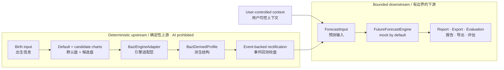

# BaZi Context Agent / 八字上下文预测引擎

**An evidence-first BaZi rectification and context-aware forecasting research prototype.**

**一个把「确定性校盘」「用户上下文」「AI 预测」严格分层的本地优先研究原型。**

[](https://github.com/130U/bazi-context-agent/actions/workflows/test.yml)
[](https://github.com/130U/bazi-context-agent/actions/workflows/deploy-pages.yml)


[**Open the public experience →**](https://www.theodoreoy.com/bazi-context-agent/) · [Architecture](docs/ARCHITECTURE.md) · [AI boundary](docs/AI_BOUNDARY.md) · [Evaluation](docs/EVALUATION.md)

> **Public scope / 公开范围** — The browser runs the configured 15–17 question rectification flow, candidate comparison, working-chart lock, context intake, and a deterministic month-by-month branch-cycle forecast with dated support and transition windows. Ranking and forecasting use no AI. The public forecast is deliberately narrower than a full calendar-derived BaZi forecast: it relates the locked hour branch to an approximate seasonal branch for each Gregorian month and exposes that limitation in the report. / 浏览器运行配置化的 15–17 问校时、候选比较、工作结构锁定与现实上下文，并按月输出带日期的支持窗口和调整窗口；排名与推演均不使用 AI。公开版的口径比完整历法八字预测更窄：它把锁定时支与每个公历月近似的季节支做关系推导，并在报告中明确披露这一限制。

Recorded birth time is treated as evidence, not ground truth. The system preserves uncertainty, generates and ranks candidates with deterministic code, compares them against dated life events, and only then allows user-controlled context to inform downstream forecasting.

本项目不把记录出生时间当作绝对真值：先保留不确定性，用确定性代码生成和排序候选盘，以有日期的人生事件进行校盘；完成上游证据流程后，才允许用户可控上下文进入下游预测。

## 60-second tour / 60 秒速览

| Question / 问题 | Design answer / 设计回答 | Verifiable evidence / 可验证证据 |
|---|---|---|
| Can AI decide the chart? / AI 能定盘吗？ | No. Candidate generation, ranking, and rectification are deterministic. | [`tests/noAiBoundary.test.ts`](tests/noAiBoundary.test.ts), [`tests/rectificationV2.test.ts`](tests/rectificationV2.test.ts) |
| Can context leak into ranking? / 上下文会回流到排序吗？ | No. `context_box` enters `ForecastInput` only after the chart evidence is fixed. | [`src/forecastInputBuilder.ts`](src/forecastInputBuilder.ts), [`tests/forecastInput.test.ts`](tests/forecastInput.test.ts) |
| Is user data controllable? / 用户能控制数据吗？ | Sessions are local-first; facts can be hidden, redacted, deleted, exported, or cleared. | [`src/sessionStore.ts`](src/sessionStore.ts), [`tests/stage8Session.test.ts`](tests/stage8Session.test.ts) |
| Is the forecast layer evaluated? / 预测层有评估吗？ | Offline A/B/C/D modes isolate derivative, context, default-chart, and selected-chart inputs. | [`src/benchmarkRunner.ts`](src/benchmarkRunner.ts), [`tests/stage7Evaluation.test.ts`](tests/stage7Evaluation.test.ts) |
| Can the result be reproduced? / 结果能复现吗？ | The repository contains 120+ automated checks and a zero-dependency Node test path. | [`tests/`](tests/), [`package.json`](package.json) |

---

## Why This Exists / 为什么做这个项目

**EN** - Many BaZi tools assume the recorded birth time is correct and then produce a generic reading. In practice, a birth time can be rounded, uncertain, close to a boundary, or recorded under inconsistent assumptions. This project treats BaZi work as a staged pipeline: preserve uncertainty, generate chart candidates deterministically, compare candidates with dated life events, and only then use structured context for forecasting.

**中文** - 很多八字工具默认记录出生时间就是准确的，然后直接输出泛化解读。但现实中，出生时间可能被四舍五入、只知道大概时段、接近子时或节气边界，甚至记录口径本身不一致。本项目把八字分析拆成分阶段流程：保留不确定性，确定性生成候选盘，用有年份的人生事件做校盘比较，然后才让用户可控上下文进入预测阶段。

---

## Core Formula / 核心公式

```text
Derivative function / 导函数
= BaZi pillars + derived BaZi structure
= 八字八变量 + 五行/十神/藏干/纳音/神煞/关系等派生结构

Initial value / 初始值
= user-controlled context profile
= 用户主动填写并可控制用途的现实上下文

Forecast / 预测
= derivative function + initial value + current date + forecast horizon
= 导函数 + 初始值 + 当前日期 + 预测周期
```

**EN** - The system does not ask an LLM to decide the birth hour, rank candidates, or modify the selected chart. AI can be used only after deterministic ranking and rectification have produced structured inputs.

**中文** - 系统不会让 LLM 决定出生时辰、候选盘排序或选定盘。AI 只能在确定性候选盘排序和校盘完成之后，基于结构化输入生成预测、解释和报告。

---

## What Makes It Different / 差异点

| EN | 中文 |
|---|---|
| **Deterministic chart derivation**: chart candidates and derived profiles are produced by code before AI is allowed. | **确定性排盘与派生**：候选盘和八字派生结构先由代码生成，AI 不参与定盘。 |
| **BaZi derived-function engine**: chart data is normalized into a `BaziDerivedProfile` for downstream forecasting. | **八字导函数引擎**：将八字结构统一整理成 `BaziDerivedProfile`，供后续预测使用。 |
| **Context-aware forecast**: user-controlled context can personalize forecasts after chart derivation. | **上下文增强预测**：用户可控的信息框可在定盘完成后用于个性化预测。 |
| **Ephemeral public privacy**: the Pages experience keeps sensitive answers in tab memory only and removes known legacy storage on entry and exit; export is explicit. | **公开版临时会话隐私**：敏感答案只留在标签页内存；进入和退出时清理已知旧存储，导出必须由用户主动触发。 |
| **Evaluation benchmark**: A/B/C/D modes compare derivative-only, context-only, default-chart, and full-system variants. | **评估基准**：A/B/C/D 模式比较只看导函数、只看初始值、默认盘和完整系统。 |
| **Explicit AI boundary**: AI cannot alter upstream chart evidence or deterministic ranking. | **明确 AI 边界**：AI 不能回流修改上游排盘证据或确定性排序。 |

This public README intentionally describes the high-level architecture, not private scoring heuristics or prompt recipes.

本 README 只描述高层架构，不公开私有评分细节或提示词策略。

---

## Architecture / 架构



Important boundary / 关键边界：

```text
context_box -> ForecastInput only / 信息框只进入预测输入
context_box -/-> ranking or rectification / 不进入排序或校盘
AI -/-> ranking or rectification / AI 不参与排序或校盘
```

The deployed browser core is split into `shared → branches → rectification / forecast`, with [`site/engine.js`](site/engine.js) as a stable facade. UI code consumes structured results and does not own scoring. See the [architecture contract](docs/ARCHITECTURE.md) for module responsibilities, security gates, and extension points.

线上浏览器核心按 `shared → branches → rectification / forecast` 分层，[`site/engine.js`](site/engine.js) 只作为稳定外观层；UI 只消费结构化结果，不持有评分逻辑。模块职责、安全门禁与扩展点见[架构契约](docs/ARCHITECTURE.md)。

---

## Tech Stack / 技术栈

| Layer | Stack / Approach |
|---|---|
| Runtime | Node.js + TypeScript |
| Tests | Node.js built-in `node:test` |
| UI | Vanilla ESM: static Pages app plus a separate local Node research UI |
| Config | JSON policy/config files under `configs/` |
| BaZi engine | Adapter boundary via `BaziEngineAdapter` |
| Prediction provider | Mock by default; OpenAI only behind server-side env flag |
| Privacy | Local-first session controls, redaction, export/import |
| Evaluation | Offline holdout benchmark modes A/B/C/D |

---

## Quick Start / 快速开始

Requirements / 环境要求：**Node.js 24+**. The project has no runtime dependencies, so no install step is required for the test and local-demo paths below. / 项目无运行时依赖，以下测试与本地演示无需安装依赖。

```bash
git clone https://github.com/130U/bazi-context-agent.git
cd bazi-context-agent
npm ci --ignore-scripts
npm run check
npm run preview
npm run ui
```

Open [`http://127.0.0.1:4173`](http://127.0.0.1:4173) for the deployable public experience. `npm run ui` separately starts the broader research workspace at [`http://127.0.0.1:3000`](http://127.0.0.1:3000), using fictional fixtures.

访问 [`http://127.0.0.1:4173`](http://127.0.0.1:4173) 可预览将部署的公开体验；`npm run ui` 会另行在 [`http://127.0.0.1:3000`](http://127.0.0.1:3000) 启动使用虚构样例的完整研究工作台。

Windows PowerShell:

```powershell
npm.cmd test
npm.cmd run preview
npm.cmd run ui
```

Public browser experience / 公开浏览器体验：

- Live / 在线：<https://www.theodoreoy.com/bazi-context-agent/>
- Source / 源文件：[`site/index.html`](site/index.html)
- Build config / 构建配置：`npm run build:site`
- Verify repository / 验证仓库：`npm run check`
- Scope / 范围：config-backed, browser-only, no login, no API key, no model call, zero session persistence; the dated branch-cycle forecast is not a full calendar-derived chart / 配置驱动、仅浏览器端、无需登录或密钥、不调用模型、会话零持久化；带日期的时支周期推演不等同于完整历法派生盘

---

## AI Boundary / AI 边界

**EN** - AI may generate forecast language and reports only after deterministic structures already exist. It must not decide the chart, rank candidates, alter rectification, change the selected chart, or modify the `BaziDerivedProfile`.

**中文** - AI 只能在确定性结构已经生成之后，用于生成预测文本和报告。AI 不得定盘、排序候选盘、修改校盘、改变选定盘或改写 `BaziDerivedProfile`。

Allowed after deterministic inputs:

- context-aware forecast;
- report generation;
- explanation and uncertainty notes.

在确定性输入完成后允许：

- 上下文增强预测；
- 报告生成；
- 解释和不确定性说明。

Not allowed:

- AI deciding birth hour;
- AI modifying candidate scores;
- AI changing selected chart;
- context box affecting rectification ranking.

不允许：

- AI 决定出生时辰；
- AI 修改候选盘分数；
- AI 改变选定盘；
- 信息框影响校盘排序。

---

## Privacy / 隐私

**EN** - The public Pages experience is ephemeral by default: birth data, life events, context, and reports stay in tab memory only. It does not save or resume sessions through browser storage; entry, explicit exit, refresh, and tab closure remove this app's known legacy storage keys without clearing unrelated same-origin data. JSON export remains an explicit user action and may contain sensitive answers.

**中文** - 公开 Pages 体验默认采用临时会话：出生资料、人生事件、现实上下文和报告只存在于当前标签页内存，不通过浏览器存储保存或恢复。进入、明确退出、刷新或关闭标签页时，只删除本应用已知的旧存储键，不会清空同源个人站的其他数据。JSON 导出仍需用户主动触发，并可能包含敏感答案。

Do not commit:

- real `.env` files;
- real API keys;
- GitHub tokens;
- private user cases;
- personally identifying benchmark data.

请勿提交：

- 真实 `.env` 文件；
- 真实 API key；
- GitHub token；
- 私人命例；
- 可识别身份的评估数据。

---

## Evaluation / 评估

The project includes an offline holdout benchmark harness. It compares modes such as:

| Mode | Meaning | 中文 |
|---|---|---|
| A | derivative only | 只看导函数 |
| B | initial value only | 只看初始值 |
| C | default chart + initial value | 默认盘 + 初始值 |
| D | selected chart + initial value | 选定盘/校正盘 + 初始值 |

This framework supports comparative evaluation under holdout conditions. It does not claim guaranteed accuracy.

该框架支持在留出条件下做对比评估，但不宣称保证准确。

---

## Roadmap / 开发路线

| Stage | EN | 中文 | Status |
|---:|---|---|---|
| 1 | Scaffold | 项目骨架 | Done |
| 2 | Questionnaire + deterministic scoring | 问卷与确定性评分 | Done |
| 3 | Local UI flow | 本地 UI 流程 | Done |
| 4 | Prediction + report layer | 预测与报告层 | Done |
| 5 | BaZi derived-function pipeline | 八字导函数管线 | Done |
| 6 | Future forecast engine | 未来预测引擎 | Done |
| 7 | Evaluation benchmark | 评估基准 | Done |
| 8 | Privacy/storage/user control | 隐私、存储、用户控制 | Done |
| 9 | GitHub release polish | GitHub 发布包装 | Done |
| 10 | Public demo + repository hygiene | 公开演示与仓库整理 | Done |

---

## Limitations / 局限

**EN** - This is a research prototype. BaZi and metaphysical analysis should not be used as medical, legal, financial, or safety-critical advice. Forecasts are structured interpretations, not guarantees.

**中文** - 本项目是研究型原型。八字和玄学分析不应作为医疗、法律、金融或安全关键决策依据。预测是结构化解释，不是保证。
